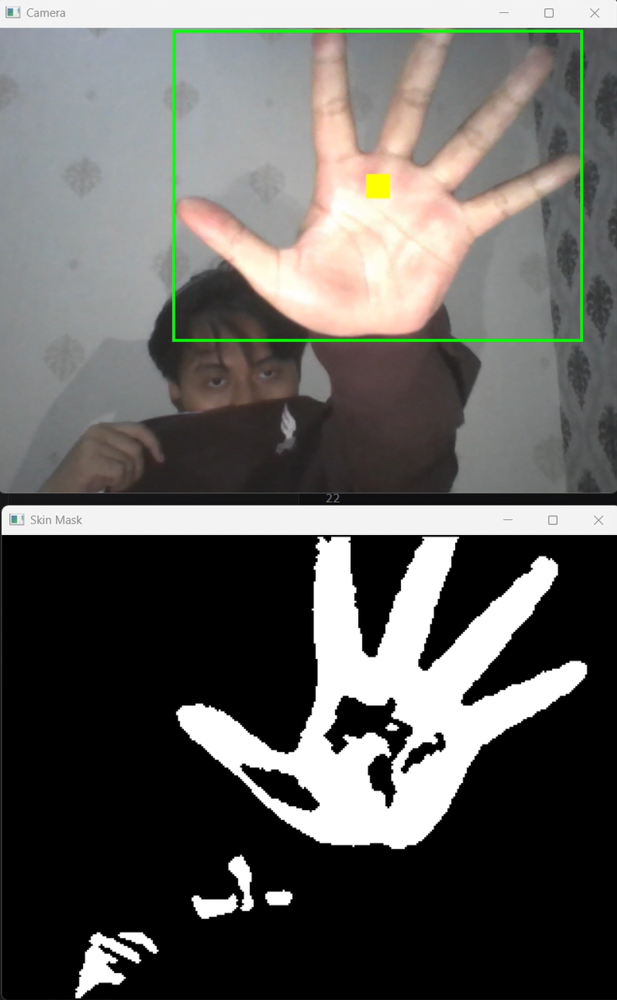
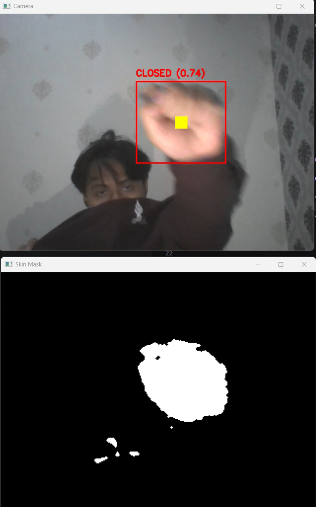
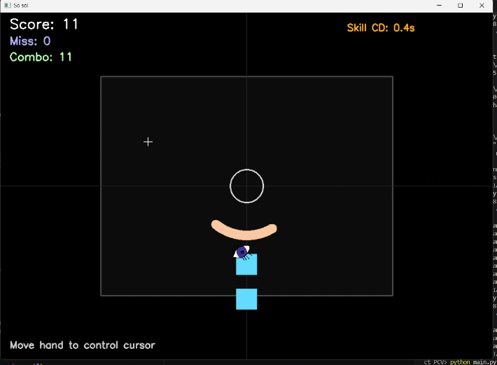

# So So! - Project PCV

Faruq Awliya Labiib - 5024241020

Sebuah proyek Rhythm Game untuk PCV berbasis Python yang memanfaatkan teknologi Computer Vision (Visi Komputer). Game ini mendeteksi posisi tangan pemain menggunakan kamera (webcam) secara real-time untuk mengendalikan kursor tameng (shield) guna menghalau notes yang datang dari 4 arah mata angin (`top`, `bottom`, `left`, `right`).

Proyek ini dikembangkan menggunakan kombinasi OpenCV untuk pengambilan citra dan interface, Pygame Mixer untuk play audio, serta NumPy untuk image processing, alpha blending, dan morfologi.

---

## Demonstrasi Proyek & Tangkapan Layar

### Video Demonstrasi
[Video Gameplay CV Rhythm Game](https://youtu.be/hVtM1REGCdU)

*(Klik link di atas untuk melihat video demonstrasi teknis dan gameplay proyek)*

### Tangkapan Layar Game (Gameplay Screenshots)
#### Opening Gesture Mask 
  
#### Closing Gesture Mask
 
#### Gameplay 
   

---

## Laporan & Dokumentasi Teknis

### 1. Segmentasi Warna Kulit (Skin Masking) & Morfologi NumPy
- Citra dari kamera dikonversi ke ruang warna HSV untuk memisahkan nilai intensitas cahaya dengan rona warna kulit secara adaptif.
- Pembersihan noise bintik putih luar menggunakan operasi Opening, dan penyambungan sela kosong jari menggunakan operasi Closing. Kedua operasi ini diimplementasikan secara manual menggunakan teknik Shift 2D Vektor NumPy (`np.roll` & logika bitwise) untuk mempertahankan performa real-time 60 FPS pada matriks 2D gambar.

### 2. Deteksi Gestur Berdasarkan Analisis Geometri Kepadatan (Solidity)
- Setelah komponen tangan terbesar diisolasi, sistem mengekstrak ROI (Region of Interest) dari bounding box tangan.
- Nilai rasio kepadatan piksel kulit dikalkulasi secara desimal (density ratio). Jika tangan mengepal rapat (`CLOSED`), rasio piksel akan tinggi karena area kotak terisi penuh. Jika tangan membuka lebar (`OPEN`), rasio akan anjlok akibat adanya celah di sela-sela jari.

### 3. Mekanik Skill Penguat Tameng (Buff Shield 150°)
- State Normal (`CLOSED`): Pemain mempertahankan kepalan tangan untuk mengendalikan tameng berukuran normal dalam menangkis notes.
- State Skill (`OPEN`): Ketika pemain membuka telapak tangan, sistem mendeteksi transisi gestur dan memicu skill yang memperluas busur lingkaran tameng secara drastis menjadi 150 derajat selama 2 detik (cooldown 10 detik).

### 4. Rendering Kursor Sprite dengan Alpha Blending Manual
- Penempelan gambar sprite kursor berformat `.png` transparan (RGBA) diproses menggunakan rumus perpaduan warna manual tingkat piksel NumPy:  
  $$\text{Output} = (\text{Sprite Color} \times \text{Alpha}) + (\text{Background Color} \times (1 - \text{Alpha}))$$

---

##  Struktur Direktori Kode Sumber Utama

```text
├── assets/
│   ├── songs/
│   │   └── Hatsukoi 1_1 BGM - Light Staff - Rend...   # File audio musik latar permainan
│   ├── stages/
│   │   └── stage_01/
│   │       ├── chart.json          # File data biner koordinat chart lagu
│   │       └── stage.json          # Konfigurasi panggung/level permainan
│   └── kursor.png                  # File sprite kursor transparan (RGBA)
├── .gitignore                      # File pengecualian pelacakan Git
├── hand_detection.py               # Modul masking HSV, Morfologi, & Deteksi Gestur
├── main.py                         # Entry point utama aplikasi & pengatur loop
├── requirements.txt                # Daftar dependensi modul pihak ketiga
├── rhythm_game.py                  # Modul logika game, collision notes, & Alpha Blending
└── stage_loader.py                 # Modul utility pemuat konfigurasi file JSON 
```

## Panduan Instalasi & Persiapan Teknis
### 1. Prasyarat Sistem
Pastikan komputer Anda sudah terpasang Python 3.10 atau versi yang lebih baru 

### 2. Kloning Repositori & Navigasi Folder
Clone repository ini dan masuk ke folder
### 3. Instalasi Dependensi Pustaka
Instal seluruh libraries yang diperlukan melalui pip:

```Bash
pip install -r requirements.txt
```
### Panduan Kontrol Permainan
Jalankan aplikasi melalui terminal komputer Anda:

```Bash
python main.py
```
- Memulai Game: Pada menu awal bertuliskan "so so!", tekan tombol SPASI (Spacebar), tombol S, atau Klik Kiri Mouse pada jendela permainan untuk memutar musik latar.

- Mekanik Bertahan: Kepalkan tangan Anda (CLOSED) di depan kamera untuk mengarahkan tameng melingkar berukuran normal demi menghalau balok notes yang meluncur dari luar.

- Memicu Skill: Buka telapak tangan Anda lebar-lebar (OPEN) untuk melebarkan busur tameng menjadi 150 derajat selama 2 detik ketika diserang gerombolan ketukan padat.

### Navigasi Sistem:

- Tekan tombol R untuk mereset bagan lagu dan mengulang dari awal (Restart).

- Tekan tombol Q untuk menutup paksa kamera dan keluar dari game (Quit).

## Tuning Parameter
Parameter toleransi sensitivitas dapat dikonfigurasi langsung pada file:

- hand_detection.py: Sesuaikan nilai desimal GESTURE_THRESHOLD = 0.55 untuk menaikkan/menurunkan sensitivitas pembacaan kepalan tangan berdasarkan kondisi pencahayaan ruangan Anda. 
Sesuaikan juga :
    - SKIN_H_MIN,
    - SKIN_H_MAX,
    - SKIN_S_MIN,
    - SKIN_S_MAX,
    - SKIN_V_MIN.

- main.py: Ubah konstanta bolean TEST_MOUSE_CONTROL = True jika Anda ingin menguji mekanik permainan menggunakan gerakan kursor mouse tanpa menyalakan webcam.